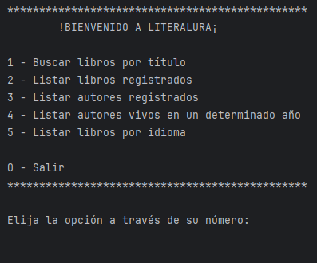
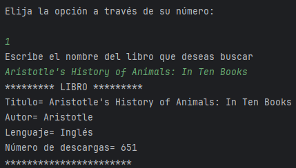
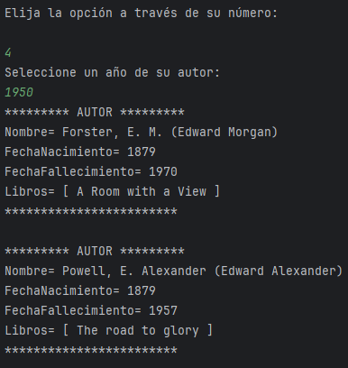

## LIBRERÍA LITERALURA

El siguiente desarrollo consiste en la creación de una librería que permite al usuario obtener una amplia variedad de ejemplares, apoyandose en uso de una API, adicional las consultas serán almacenadas en una base de datos, que puede ser consultada mediante el uso de comandos de consola.

### Caracteristicas generales
* El programa es capaz de traer información desde una API configurada.
* Los datos consultados serán almacenados en una base de datos para su posterior consulta.
* El programa cuenta con diversidad de filtros, para que el usuario pueda traer la información almacenada en la base de datos.


## 🛠 Skills
* Java
* Spring Boot 3
* JPQL
* PostgreSQL
* Jackson Serializer


## Instalación
1. Clona el repositorio:

   ``` git clone https://github.com/Sanepo/Challenge-Literalura.git```


2. Accede al proyecto:

   ```cd Challenge-Literalura```


3. Ejecuta el programa en el IDE de tu preferencia.


## Ejemplos de uso
El usuario al iniciar el programa verá un menú de selección, donde
puede determinar la acción que quiere realizar de forma
indeterminada hasta que decida salir usando la opción correspondiente.

### Menú principal 


### Selección de libro


### Filtro de autores por años 



## Authors

- [@sanepo](https://www.github.com/sanepo)

